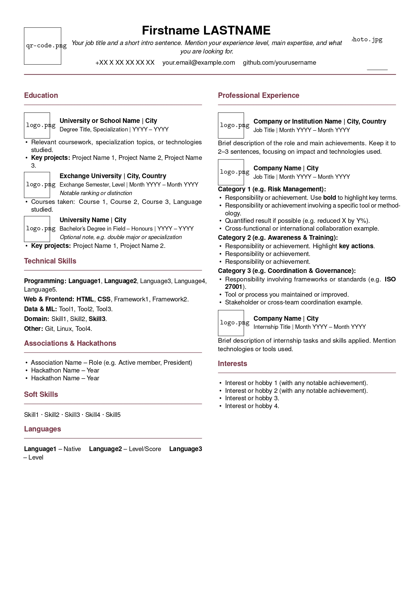

# LaTeX CV Template – Two-Column Resume

A clean, professional two-column CV template built with LaTeX. Designed for engineering and tech profiles, with support for company/school logos, a circular profile photo, and a LinkedIn QR code.



---

## Features

- Two-column layout (Education & Skills | Professional Experience)
- Company/school logos next to each entry
- Circular profile photo in header
- LinkedIn QR code in header
- Customizable accent color
- Clean section separators
- Works great on Overleaf

---

## Getting Started

### Option 1 – Overleaf (recommended, no install needed)
1. Go to [overleaf.com](https://overleaf.com) and create a new **Blank Project**
2. Delete the default content and paste the content of `cv_template.tex`
3. Upload your images (see required files below)
4. Click **Recompile**

### Option 2 – Local compilation
```bash
pdflatex cv_template.tex
```
Requires a full LaTeX installation (TeX Live or MiKTeX).

---

## Required Files

| File | Description |
|------|-------------|
| `cv_template.tex` | Main LaTeX source file |
| `photo.jpg` | Your profile photo (square crop recommended) |
| `qr-code.png` | Your LinkedIn QR code |
| `school1_logo.png` | Logo for each school/company entry |

> Rename logo files to match the filenames used in `\logoentry{...}` calls in the `.tex` file.

---

## Customization

### Change accent color
Find this line in the preamble and edit the RGB values:
```latex
\definecolor{accentcolor}{RGB}{120, 47, 64}
```
Some examples:
| Color | RGB |
|-------|-----|
| Bordeaux (default) | `120, 47, 64` |
| Navy blue | `0, 90, 160` |
| Forest green | `40, 120, 70` |
| Dark gray | `60, 60, 60` |

### Resize logos
Find the `\logoentry` command definition and change `height=1.3cm`:
```latex
\includegraphics[width=\linewidth,height=1.3cm,keepaspectratio]{#1}
```

### Bold text
```latex
\textbf{This text will be bold}
```

### Italic text
```latex
\textit{This text will be italic}
```

### Add a line break inside a \logoentry subtitle
```latex
\logoentry{logo.png}{Title | City}{Subtitle | Dates \\ \textit{Additional note}}
```

---

## LaTeX Packages Used

All packages are available by default on Overleaf and in TeX Live:

`geometry` · `xcolor` · `hyperref` · `enumitem` · `titlesec` · `paracol` · `microtype` · `graphicx` · `tikz` · `helvet`

---

## License

Free to use and adapt for personal use.
